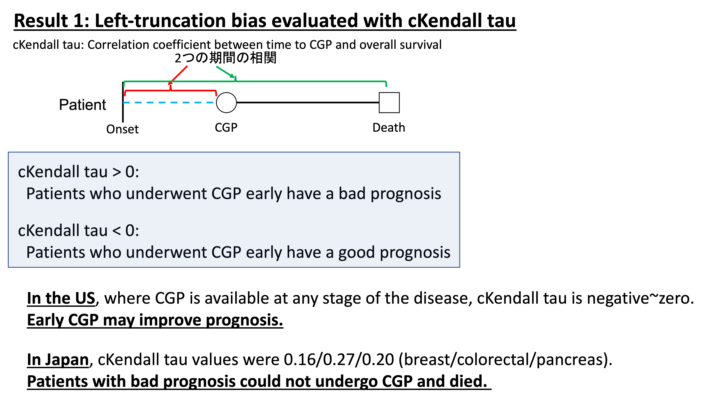

# Files for analysis of C-CAT survival data.  
Supplementary code for the paper: Tamura T, et. al., Selection Bias Due to Delayed Comprehensive Genomic Profiling in Japan. Cancer Sci. 2022 Nov 12.  doi: 10.1111/cas.15651. Online ahead of print.  
[link for the paper](https://onlinelibrary.wiley.com/doi/10.1111/cas.15651)  
This explanation text was written in Japanese. Please use [DeepL translator](https://www.deepl.com/translator).  
C-CATのユーザーは基本的に日本人と思われますので、説明は日本語で記載します。  

# C-CATのデータにおける左側切断と右側打ち切りによる生存期間解析への影響
がんゲノム検査(CGP: comprehensive genomic profiling)を受ける患者は、発症後様々な治療を受けていき、全ての標準治療を終了してから検査にエントリーします（保険適応がそうなっています）。そのため検査登録前の情報が欠落してしまいます。これを左側切断と呼びます。進行が非常に早い患者はがんゲノム検査を受ける前に死亡してしまうこと、主治医と患者の考えによって検査のエントリー時期にばらつきが出ることから、C-CATに登録されている患者情報には少なからずバイアスが生じています。    
    

また、化学療法の開始後の生存期間を考える場合、生存期間の開始日と観察開始日が異なることから、通常のKaplan-Meier estimatorでは正確な生存曲線を推定することが困難です。以下の様に、検査後早期の患者群は見かけ上良好な生存率を示しますが、経時的に生存曲線が左下にシフトしていき、徐々に真の曲線に近づいていきます。しかし、全ての患者が打ち切り無く死亡まで観察されない限りはバイアスがなくなることはありません（そしてそのようなことは現実的には不可能です）。    
  
SPT: survival prolonging therapy    

このバイアスの存在のため、現状ではC-CATのデータを用いた生存期間の解析は困難といえます。個人的には診断時のStageの記載が無いことも活用の幅を狭めている大きな要因と思いますが、3万症例を超えるビッグデータがあるにも関わらず、遺伝子変異プロファイルや免疫染色などの静的な情報のみしか活用できないというのはもったいないと感じました。  
日本ではクリニカルシークエンスの情報がC-CATに集約されていますが、アメリカでは多数のhigh-volume cancer centerが協力しAACR Project GENIEのもとに情報を集約し公開しています。  
[AACR Project GENIE](https://www.aacr.org/professionals/research/aacr-project-genie/)    

このGENIEのデータを用いた論文は複数発表されており、その中には何とかこの左側切断によるバイアスを解消しようとして、risk-set adjustmentという手法を使用したものがあります。しかし、この手法が使用できる状況は限定されており、これらの論文では不適切な使用となっています。    
[Publications from AACR Project GENIE](https://www.aacr.org/professionals/research/aacr-project-genie/aacr-project-genie-publications/)  
[左側切断によるバイアスの現状とRisk-set adjustmentの限界を述べた論文](https://www.ncbi.nlm.nih.gov/pmc/articles/PMC9190030/)  
[不適切な補正手法が用いられている論文](https://aacrjournals.org/cancerdiscovery/article/10/4/526/2419/Characteristics-and-Outcome-of-AKT1E17K-Mutant)    

左側切断による選択バイアスを評価する指標として、conditional Kendall tau統計量があります。これは、生存期間解析の評価開始日と観察開始日が異なる場合に、評価開始日から観察開始日までの期間と、評価開始日から最終観察日までの期間の相関係数を意味します。なお、cKendall tauがゼロの場合のみrisk-set adjustmentによるバイアス補正が妥当であることが示されています。  
[tranSurv: structural transformation methodでの補正手法](https://github.com/stc04003/tranSurv)    
    

C-CATのデータの場合、どのイベントを生存期間解析の評価開始日にすべきかは悩ましくあります。診断時のステージが不明であるため、「stage IVの患者が診断されてからの生存期間解析」という一般によく見られる解析は不可能です。使用された化学療法と使用開始日は分かるため、化学療法開始後の生存期間解析は可能ですので、各種組織型について進行期となってから最初に行われた化学療法からの生存期間解析を行うことにしました。この場合、cKendall tauが正の値であると「化学療法開始後早期にCGPを受けた患者は全生存期間が短い」、負の値であると「化学療法開始後早期にCGPを受けた患者は全生存期間が長い」ということになります。      

本研究の結果、日本においては基本的に全てのがん種でcKendall tauは正の値でした。なおアメリカのDana-Faberからの診断日を評価開始日とした報告では、診断時stage 1-3の患者ではcKendall tauが負、診断時stage 4の患者ではcKendall tauが概ねゼロとなっていました。日本とアメリカの大きな差異として、アメリカでは進行期や治療内容に関わらずどのタイミングでもCGPを受けることができる点が挙げられます。これの結果から推定される事柄として、進行期になる前に早めに検査を受けることが予後改善に繋がる、健康意識が高くCGP検査を早期に受けるような患者はそもそも予後が良い、あまりに進行した状態でCGPを受けても予後改善には繋がらない、といったことが考えられると思います。    

この左側切断による選択バイアスについては統計学者の間でも補正手法の開発が行われており、とくに日本からは[江村剛志](https://sites.google.com/view/takeshi-emura)先生が第一人者として知られています。左側切断による選択バイアスの補正手法はいくつかのR言語用のパッケージとして公開されています。  
[tranSurv: structural transformation methodでの補正手法](https://github.com/stc04003/tranSurv)  
[depend.truncation: copula-graphic estimatorでの補正手法](https://cran.r-project.org/web/packages/depend.truncation/index.html)    

しかし、tranSurvパッケージを使用して補正を試みたところ、大腸癌の初回化学療法後の生存曲線が右上に凸となり、臨床的に妥当性を欠く結果となってしまいました(下図実線)。なお、本検討のようにcKendall tauが正のデータにNumber at risk adjustmentの手法で補正を行うと過度に補正されて生存期間を極めて短く推定してしまいます(下図点線)。    
  

現状のデータでは正確な全生存期間を推定できないことが分かったため、生存期間を二つに分割して考えることにしました。化学療法の開始からCGPまでの期間と、CGPから最終観察日までの期間については各患者から情報を得られます。そして、これらは左側切断がない生存情報であるため、通常のKaplan-Meier estimatorでの生存期間解析が可能です。全患者が必ずCGPを受けていますので、化学療法からCGPまでの期間は全く打ち切りがありません。CGPまでの期間で作成した生存曲線は概ね指数関数の様な形状でしたが、極めて初期の段階では傾きが小さく、あまりCGP検査を受ける症例が多くない傾向が見られました。この現象は様々な解釈が可能です。治療開始早期は化学療法の奏功率が高いが徐々に無効例が増加していくということなのかもしれません。本研究ではこの現象が「非常に進行の早い患者は化学療法実施中にも病状が進行するため、CGPを受ける機会を得ないまま死亡する」ということが原因とみなして解析を進めました。また、CGPまでの期間が中央値より短い半数の症例と長い半数の症例に分けて、CGP後の生存期間を通常のKaplan-Meier estimatorで推定すると、早期にCGPを受けた患者は予後が悪いことがわかりました。このことはcKendall tauが正であることと合致しています。    
    
  
化学療法開始からCGP検査までの生存曲線に左側切断による選択バイアスが潜んでいると考えましたので、下図の通り一部の患者を除外して真の生存曲線を推定することにしました。      
  
    

その上で、二つの生存曲線をWeibull分布で近似し、この生存曲線から得られる生存期間を足し合わせることで全生存期間を推定できるのではないかと考えました。これにより、各がん種での生存期間を実際の臨床に近い値で推定することができました。  
  
   
  
下図の通り、緑色の線で示されているNumber at riskを調整した手法での補正は生存率を過度に悪く推定してしまいました。
  
    

Stan言語を用いたBayes推定によってシミュレーションを行っています。この領域ではKazuki Yoshida先生がわかりやすい解説記事を作成して下さっております。ここで紹介されているStanのコードを改変し、上述の解析を可能にしました。  
[Bayesian Survival Analysis 1: Weibull Model with Stan](https://rstudio-pubs-static.s3.amazonaws.com/435225_07b4ab5afa824342a4680c9fb2de6098.html)    

以下のStanコードが解析内容の中心ですが、C-CATのデータは病名の登録等が手入力で行われているためにデータの前処理が相当に必要です。前処理も含めて一括して解析、レポート作成できるようにRmdファイルを作成しています。  
```Stan
functions {
  vector sqrt_vec(vector x) {
    vector[dims(x)[1]] res;

    for (m in 1:dims(x)[1]){
      res[m] = sqrt(x[m]);
    }

    return res;
  }

  vector bg_prior_lp(real r_global, vector r_local) {
    r_global ~ normal(0.0, 10.0);
    r_local ~ inv_chi_square(1.0);

    return r_global * sqrt_vec(r_local);
  }
}

data {
  int<lower=0> Median;
  int<lower=0> Nobs;
  int<lower=0> Ncen;
  int<lower=0> Ntot;
  int<lower=0> Nexp;
  int<lower=0> M_bg;
  vector[Ntot] ybef;
  vector[Nexp] ybef_exp;
  vector[Nobs] yobs;
  vector[Ncen] ycen;
  matrix[Nobs, M_bg] Xobs_bg;
  matrix[Ncen, M_bg] Xcen_bg;
}

transformed data {
  matrix[Nobs, M_bg] Xobs_bg_early = Xobs_bg;
  matrix[Nobs, M_bg] Xobs_bg_late = Xobs_bg;
  matrix[Ncen, M_bg] Xcen_bg_early = Xcen_bg;
  matrix[Ncen, M_bg] Xcen_bg_late = Xcen_bg;

  for (i in 1:Nobs) {
    Xobs_bg_early[i,1] = 0;
    Xobs_bg_late[i,1] = 1;
  }
  for (i in 1:Ncen) {
    Xcen_bg_early[i,1] = 0;
    Xcen_bg_late[i,1] = 1;
  }

}


parameters {
  real<lower=0> tau_s_bg_raw;
  vector<lower=0>[M_bg] tau_bg_raw;

  real alpha_raw;
  vector[M_bg] beta_bg_raw;

  real mu;

  real<lower=0> shape;
  real<lower=0> scale;
  real<lower=0> shape_exp;
  real<lower=0> scale_exp;
}

transformed parameters {
  vector[M_bg] beta_bg;
  real alpha;

  beta_bg = bg_prior_lp(tau_s_bg_raw, tau_bg_raw) .* beta_bg_raw;
  alpha = exp(10 * alpha_raw);
}

model {
  ybef ~ weibull(shape, scale);
  ybef_exp ~ weibull(shape_exp, scale_exp);
  yobs ~ weibull(alpha, exp(-(mu + Xobs_bg * beta_bg)/alpha));
  target += weibull_lccdf(ycen | alpha, exp(-(mu + Xcen_bg * beta_bg)/alpha));

  beta_bg_raw ~ normal(0.0, 1.0);
  alpha_raw ~ normal(0.0, 1.0);
  mu ~ normal(0.0, 10);
  shape ~ normal(0.0,5.0);
  scale ~ normal(300.0,300.0);
  shape_exp ~ normal(0.0,5.0);
  scale_exp ~ normal(300.0,300.0);
}

generated quantities {
  real yhat_uncens[Nobs + Ncen];
  real yhat_exp_uncens[Nobs + Ncen];
  real yhat_total[Nobs + Ncen];
  real yhat_exp_total[Nobs + Ncen];
  real ytmp[Nobs + Ncen];
  real y_exptmp[Nobs + Ncen];
  real yhat_early[Nobs + Ncen];
  real yhat_late[Nobs + Ncen];
  for (i in 1:Nobs) {
    ytmp[i] = weibull_rng(shape, scale);
    y_exptmp[i] = weibull_rng(shape_exp, scale_exp);
    yhat_early[i] = weibull_rng(alpha, exp(-(mu + Xobs_bg_early[i,] * beta_bg)/alpha));
    yhat_late[i] = weibull_rng(alpha, exp(-(mu + Xobs_bg_late[i,] * beta_bg)/alpha));
    if (ytmp[i] <= Median)
      yhat_uncens[i] = yhat_early[i];
    else
      yhat_uncens[i] = yhat_late[i];
    if (y_exptmp[i] <= Median)
      yhat_exp_uncens[i] = yhat_early[i];
    else
      yhat_exp_uncens[i] = yhat_late[i];
    yhat_total[i] = yhat_uncens[i] + ytmp[i];
    yhat_exp_total[i] = yhat_exp_uncens[i] + y_exptmp[i];
  }
  for (i in 1:Ncen) {
    ytmp[Nobs + i] = weibull_rng(shape, scale);
    y_exptmp[Nobs + i] = weibull_rng(shape_exp, scale_exp);
    yhat_early[Nobs + i] = weibull_rng(alpha, exp(-(mu + Xcen_bg_early[i,] * beta_bg)/alpha));
    yhat_late[Nobs + i] = weibull_rng(alpha, exp(-(mu + Xcen_bg_late[i,] * beta_bg)/alpha));
    if (ytmp[Nobs + i] <= Median)
      yhat_uncens[Nobs + i] = yhat_early[Nobs + i];
    else
      yhat_uncens[Nobs + i] = yhat_late[Nobs + i];
    if (y_exptmp[Nobs + i] <= Median)
      yhat_exp_uncens[Nobs + i] = yhat_early[Nobs + i];
    else
      yhat_exp_uncens[Nobs + i] = yhat_late[Nobs + i];
    yhat_total[Nobs + i] = yhat_uncens[Nobs + i] + ytmp[Nobs + i];
    yhat_exp_total[Nobs + i] = yhat_exp_uncens[Nobs + i] + y_exptmp[Nobs + i];
  }
}
```

この手法は各がん種の生存期間の推定を可能にするだけではなく、生存期間に影響を与える因子の影響も推定することを可能にします。ある遺伝子のがん化変異の有無での生存期間の違い、治療内容による生存期間の違いを算出することで、新たな治療ターゲットの発見や適切な治療方法の開発が可能になる可能性があります。以下には大腸癌患者におけるBRAFがん化変異、エストロゲン受容体陽性乳がん患者におけるAKT1 E17K変異、膵癌患者における初回化学療法のレジメンの生存期間への影響を推定した例を挙げます。  
  
大腸癌におけるBRAFがん化変異は予後不良因子として知られています。  
    
  
ER陽性乳がん患者における比較的稀ながん化変異であるAKT1 E17K変異の生存期間への影響は種々の報告があり一貫していません。本件等では有意差はないものの予後を短縮させる効果が示唆されました。今後の患者数の増加で有意差がつくものと思われます。  
    
  
膵がんにおける1st line化学療法は現在はGEM + nab-PTXが主流になっている様ですが、FOLFIRINOXと効果としては差は無さそうでした。  
    
  
今後のC-CATへの症例数の蓄積、観察期間の増加と打ち切りの減少によって解析の正確性が高まっていくはずです。ビッグデータの利点を活かして、比較的稀な組織型や変異の生存期間や薬剤奏効性への影響、複数の治療内容の比較といった解析が進んでいくことが望まれます。  
  
  
C-CATに登録されている情報は随時アップデートされており、論文で使用したのは2022年4月時点での登録情報でした。列名の変更などもあり、2022年11月時点の登録情報については修正されたプログラムを使用する必要があります。登録情報にあわせたZIPファイルをダウンロード、展開し、その下のディレクトリ内にC-CATからダウンロードした症例情報と変異情報のcsvファイルを全てコピーします。RmdファイルをRstudioで読み込み、Working directoryをRmdファイルのあるディレクトリに設定すると動作します。Windowsの環境では上手く動かないことが多い様ですので、適宜Mac, linux, [posit cloud](https://posit.cloud)などの環境で動作させることをおすすめします。  

不明点がありましたら[池上政周](https://onlinelibrary.wiley.com/doi/10.1111/cas.15651)までメールください。宜敷お願いいたします。  
